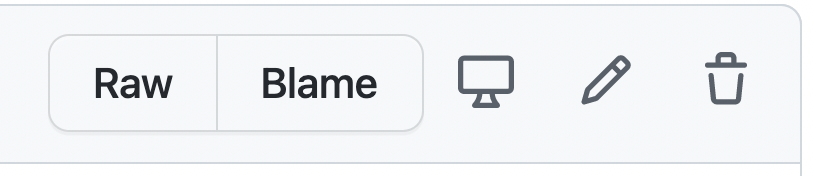

# Introduction

## A collaborative document

This little document will take us through the GENE312 project on Hoiho diet. 
This is a collaborative document, if you spot a typo, 
you can change it by clicking on the little pen 
on the top right of the document: 

{width=50% height=50%} 


Github works with version control, meaning each version of the 
document is recorded in a time machine. There is no need to create new files 
*tutorial1.md, tutorial2.md*, each version of the current file is recorded 
forever. We can always go back, there is nothing to lose. It is a great way of 
working together and in a reproducible manner.

If something is unclear, just write it up quickly in the issues issuesissues section, 
that will give me a chance to explain it better to you, but also to improve 
this tutorial for the groups coming after you.

## Analyses summary

We will compare six samples from Otago Peninsula to six samples from
the Caitlins. Those are fresh poo samples from adult penguins.Those samples were 
collected as part of [Young et al. 2020, *Wildlife Research*](https://www.publish.csiro.au/WR/WR19246).

There are many different softwares that can be used to approach an environmental
DNA project. We will center our analyses on DADA2 
([Callahan et al. 2016, *Nature Methods*](https://www.nature.com/articles/nmeth.3869).
DADA2 offers a pipeline to analyse 
environmental data that center around clustering(i.w. grouping) sequences 
into Amplicon Sequence Variants (ASV). The numbe rof time eac of these individual 
genetic appear in each sample  can be summarised in an amplicon sequence 
variant (ASV) table:

```   
            Seq_1   Seq_2   Seq3
peninsula_1   0       10      20
peninsula_2   2       20      40
caitlins_1    20      0       0
caitlins_1    20      0       0
```
In this example, Seq_2 and Seq_3 are common in the peninsula samples, 
but rare in the caitlins while it is the opposite for Seq_1.

We'll then assign species ID to those sequences using a reference database. 
You'll obtain a table with species ID as below:

```
              sp1    sp2      sp3
peninsula_1   0       10      20
peninsula_2   2       20      40
caitlins_1    20      0       0
caitlins_1    20      0       0
```

This table can then be summarised in a few different ways to answer your 
questions of interest. Manipulating this table can be done in R or in excel 
as you want and it is not covered in the tutorial.
Your main question

**Do the diet of those two groups differ?**

This main question could be approached with the following sub-questions:

* What are the most common species in each group? 
* Do they differ qualitatively between groups? (i.e. different fishes)
* Do they differ quantitatively between groups? (i.e. relative abundance of fishes)

A good way to answer those questions would be to reproduce figure 3 and 4 of 
[Young et al. 2020, *Wildlife Research*](https://www.publish.csiro.au/WR/WR19246). 
You could also look at this data in any other way you want! 

This tutorial is a adapted from the [DADA2 pipeline tutorial](https://benjjneb.github.io/dada2/tutorial.html).

## Installation

The first step of any pipeline, is to install the required tools.

The simplest way to install dada2 is to run:

```
install.packages("devtools")
library("devtools")
devtools::install_github("benjjneb/dada2", ref="v1.16")
```

You can then load DADA2 and confirm that your installation worked by typing:

```{r, results=F}
library("dada2")
```

If that does not work, have a look
[here](https://benjjneb.github.io/dada2/dada-installation.html) or contact me.


## Data format

For each sample. we have two *.fastq* files inside the folder [raw_data](raw_data). 

They are text files containing all the information out of the sequencer. 
Have a look at the [fastq format Wikipedia page](https://en.wikipedia.org/wiki/FASTQ_format) 
to get a quick sense of the format. The two files correspond to forward and 
reverse reads. Those reads are sequences from the same Mitochondrial 16S fragment 
but in different directions. Because the number of nucleotides the machine can read is limited, reading
the fragment twice in different directions is a way of obtaining longer sequences
from one single DNA fragment. The first read in the forward
file match the first read in the second file, and so on. 

# Analysis

## Locating our files

We'll get a vector with  the forward reads for each sample, and a vector with 
the reverse reads for each sample. Before extracting the sample names out of the names.


```{r, results=F}
path<-"raw_data/" # Should your samples be in a different path, adapt 
forward_reads<-sort(list.files(path, pattern="_R1", full.names = TRUE)) # R1 means forward
reverse_reads <- sort(list.files(path, pattern="_R2", full.names = TRUE)) # R2 means reverse
sample_names <- sapply(strsplit(basename(forward_reads), "_"), `[`, 1) #isolate sample names
``` 

Have a look at what is inside of `forward_reads`, `reverse_reads` and `sample_names`.
How many files do you have? Can you see both the forward and the reverse files
for each of the sample?

## Trimming and Filtering

To save you a bit of time, I did some pre-filtering. I removed the low quality 
reads and I also removed thesynthetic (read lab-made) sequences that are  attached 
to the actual sequences for sequencing. We will do a little bit of extra filtering 
specific to the dada2 pipeline. 

Let's do this in two steps.

1. Define the name of the filtered files that we will create below. We will create 
one filtered file for each non-filtered file in a folder called filtered.

```{r, results=F}
dir.create("filtered") # create the folder
filtered_forward_reads <- paste("filtered/filtered_",basename(forward_reads),sep="")
filtered_reverse_reads <- paste("filtered/filtered_",basename(reverse_reads),sep="")
names(filtered_forward_reads) <- sample_names #assign sample names to file names
names(filtered_reverse_reads) <- sample_names
```
Have a look at those variable, what are they?


2. Filter the sequences:

We will now filter the sequences.

```{r, results=F}
out <- filterAndTrim(forward_reads, filtered_forward_reads, reverse_reads, filtered_reverse_reads,
              maxN=0, maxEE=c(2,2), truncQ=2, minLen = 50,rm.phix=TRUE,
              compress=TRUE, multithread=TRUE) # On Windows set multithread=FALSE
```

Have a look at the helpf of the `filterAndTrim` function by typing `?filterAndTrim`
and identify what the parameters, `maxN`, `maxEE`, `minLen` and `truncQ` are doing?
How many reads do you have left? look, inside "out".


## Clustering reads

DADA2 applies a machine learning clustering approach based on a sophisticated 
model. The first step is to identify the best parameters for this model based 
on our actual data independently for forward and reverse reads. 

```{r, results=F,message=F}
error_forward <- learnErrors(filtered_forward_reads, multithread=FALSE)
error_reverse <-learnErrors(filtered_reverse_reads, multithread=FALSE)
```


The second step is to actually run the sophisticated algorithm with the best 
parameters identified above to cluster sequences.

```{r, results=F,mnessage=F}
dada_forward <- dada(filtered_forward_reads, err=error_forward, multithread=TRUE)
dada_reverse <- dada(filtered_reverse_reads, err=error_reverse, multithread=TRUE)
```

You can have a look at the numbers sequence variants found in the forward reads 
and the reverse reads using the commands below

```{r, results=F}
dada_forward[[1]]
dada_reverse[[2]]
```

## Merging reads

So far we have considered forward and reverse reads independently so that we can do
the clustering and the modelling independently. We do know that for each of these
forward reads there is a reverse read, it is time to merge our forward reads to their reverse reads
to get the longest sequence possible. The function simply identify overlap in the reads and merge them together.

```{r, results=F,message=F}
mergers <- mergePairs(dada_forward, filtered_forward_reads, dada_reverse, filtered_reverse_reads, verbose=TRUE)
```
### Make an ASV table

We can now create this ASV table that tells us how many times each sequence variant 
it is found in each sample.

```   
            Seq_1   Seq_2   Seq3
peninsula_1   0       10      20
peninsula_2   2       20      40
caitlins_1    20      0       0
caitlins_1    20      0       0
```


They appear when two different sequences
get hybridized together during sample preparation.

```{r, results=F ,message=F}
seqtab <- makeSequenceTable(mergers)
```

As a last filtering, we will remove 
[chimeric sequences](https://www.ncbi.nlm.nih.gov/genbank/rrnachimera/). 
These sequences are artefacts, they are not real. They 
appear when two different fragments of DNA hibridise experimentally and are read 
as as if they were a single sequence.

```{r}
asv_table <- removeBimeraDenovo(seqtab, method="consensus", multithread=TRUE, verbose=TRUE)
dim(asv_table) # dim tells us the number of rows (sample) and columns (ASVs)
```

Woohoo, you got an ASV table, you genomic data hero, well done!

the column names of this table are all those independent sequences.

```{r, results=F}
colnames(asv_table)
```
 
 
Time for the last step, assigning them fish species ID.

## Assign taxonomy

To assign species ID to sequence, we need to compare those sequences
to a reference database. We need two things:

**A tool to compare our sequences to a reference database**
We will use the `assignTaxonomy` function that uses some fancy Bayesian stats to
match sequences to each other, while being aware of their taxonomy.

**A reference database**
We want a reference database that contains the exact fragment 
we sequences for all the species possible. We'll use the database from [Young et al. 2020, *Wildlife Research*](https://www.publish.csiro.au/WR/WR19246). 
It is a combination of sequences foud on [GenBank](https://www.ncbi.nlm.nih.gov/genbank/)
and locally sequenced ones for important diet species that were missing from the 
database.


```{r, results=F}
taxa <- assignTaxonomy(asv_table, "taxonomy_database/taxo_reference_dada2_youngetal_alllevels.fa", multithread=TRUE)
```

The `taxa` object contains each sequence and all the taxonomic levels it could be linked to.
Sometimes it goes to the species level, sometimes it does not. Have a look at it.

It is a bit  painful, isn't it?

Let's create a new variable and remove row names that are those long sequences that make the file impossible to look at:

```{r, results=F}
taxa_no_rownames<-taxa
rownames(taxa_no_rownames)<-NULL
```

Have a look at 'taxa_no_rownames' now. 

There are a few things to notice:

* Do you perhaps have several sequences (i.e. rows) assigned to the same species?
That is not surprising. The 16S fragment can vary slightly even within a species, leading to several sequences being from the same species.

* Do you find non-fish species in there? Which ones and why could that be?

We will now get back to the ASV table telling us which sample contains which sequence and, how many times.
But we will replace those column that contains sequences by taxonomy information.

## Combine ASV and taxa table

The column names of the asv_table become that taxa names concatenated as single words.
```{r,results=F}
colnames(asv_table)<-apply(taxa,1,paste,collapse="_")
```

Remember how we had several times the same species for slightly different sequences? You now have several columns for one species, let's combine them. The row below will do the trick:

```{r}
clean_asv_table<-t(rowsum(t(asv_table), group = colnames(asv_table), na.rm = T))
```


You can now play with this table in R or in ExcelWe will finish this tutorial by exporting the clean_asv table to a file:


To do so, we'll make the sample names, currently row names, as the first column.

```{r,results=F}
clean_asv_table<-cbind(rownames(clean_asv_table),clean_asv_table) # add a column which is rownames
rownames(clean_asv_table)<-NULL
colnames(clean_asv_table)[1]<-"sample_name"
write.table(clean_asv_table,file="clean_asv_table.txt",sep="\t",quote=F,row.names=F)
```


Congratulations, you are done!


# Downstream analyses

What is left to do could be done in R, in Excel, or by hand if you're really keen!

If you're target is to create figure 3 and 4 of *Young et al. 2020*, you'll need to different types of data:

* presence/absence (figure 3), *

* relative read abundance (figure 4)

1. First, filter out all non-fish species, those came from the lab or the poo, but were not consumed by penguins and therefore are not your focus.

Then you can create two tables.

1. A table of presence absence for each species, for each sample. That should allow you to look at frequency of occurences, in the two groups like in figure 3 of *Young et al. 2020*.

2. A table that contain the proportion of reads per group that are from each species (sum all the reads for each species by group first, then calculate proportion of those reads  belonging toe ach taxa)

You should then be in a strong position to answer our original questions:

* What are themost common taxa in each group? 
* Do they differ between groups?
* Do they differ quantitatively between groups?


